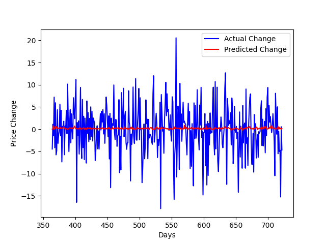

<h1>Exploring the Relationship Between WSJ Headlines and S&P500 Prices:</h1>

    This GitHub repository is a personal project of mine. This project is licensed under the MIT License. 

<h2>Background:</h2>
<ul>
    In this project, I attempted to explore if they were any trends in the Wall Street Journal's headlines that were significant in predicting movements in the S&P 500.
</ul>

<h2> Usage </h2>

<ol>
<h3><li>Data Collection</h3></li>

 <code>createDB.py </code> to create a database  
<code>crawl.py </code> to obtain obtain the data and store it in the database.
 <code>deleteDuplicates.py </code> to remove duplicate entries
 <code>removeNewLines.py </code> to remove "/n" characters
 <code>deleteIrrelevantArticle.py </code> to articles from sections that do not relate to financial markets or the economy
 <code>getSpyData.py </code> uses Yahoo Finance api to get SPY open prices for selected time frame

<h3><li>Processing and Analysis</h3></li>

 <code>wordFreq.py</code> Displays total word frequency of all headlines
 <code>sentiment-analysis.py</code> Uses a pre-trained NLP, finBert, to assign a score to each headline
 <code>llamaSentimentAnalyzer.py</code> Uses Llama 3.2 with specific system instruction to score headlines depending on how bearish or bullish they are.
 <code>getHeadlines.py</code> 
 <code>dataRead.py</code> Calculates total score for each non-holiday weekday and outputs it in json 
 <code>llamaDataRead.py</code> Same as <code>dataRead.py</code> 
 <code>dataAnalysis.py</code> and <code>getHeadlines.py</code> prints headlines and scores for manual inspection of data

<h3><li>Output</h3></li>

<code>mm-fin1.py</code> Uses tensorflow to train a machine learning model on sentiment scores: positive, negative, neutral. Outputs results as a matplot graph.
 <code>one-factor-mm-fin1.py</code> same as <code>fin1.py</code>, however, it uses only one factor, overall score, for regression. Used for llama sentiment scores.
 <code>results.xlsx</code> show the results for the linear regressions.

</ol>

<h2> Results </h2>
<h4>Initial Results
</h4>

The regression analysis of WSJ headlines against SPY prices shows very limited explanatory power, with an Adjusted R Square of -0.0022. None of the headline sentiment scores (positive, negative, and neutral) show a significant relationship with SPY prices, as indicated by high P-values well above the standard 0.05 threshold. Overall, the model suggests that these particular WSJ headline scores do not effectively predict SPY price changes, indicating no meaningful correlation. Further model refinements or different data might will be needed to capture any potential relationships.

<h4>
Data from Relevant Sectors Only
</h4>

For the second version, I used headlines only from sectors I deemed directly relevant to the economy or financial markets. The list of sectors selected can be found in sectors.csv. 
With an Adjusted R Square of 0.0048, the model explains very little of the variance in SPY.

The positive score has a coefficient of 0.02, showing a non-significant relationship with SPY prices (P-value: 0.8545). The negative score, at -0.11, shows a negative relationship but is not statistically significant (P-value: 0.1040). Notably, the neutral score, with a coefficient of 0.1769, is positively correlated with SPY prices and significant at the 0.05 level (P-value: 0.0257). 

Despite slight improvements from using the more limited data set, the model does not make any effective predictions for changes in SPY prices. Among the variables, only the neutral score shows a statistically significant association with SPY price increases, suggesting some potential relevance. These counterintuitive results led me to decide to improve the model behind the sentiment analysis. 

<h4>
Using Llama 3.2 for Sentiment Analysis
</h4>

In this iteration, I used ollama to run Llama 3.2 locally, outputting one overall sentiment score for each entry in the dataset. The regression analysis for using Llama 3.2 again shows minimal explanatory power for predicting SPY price. The Adjusted R Square is -0.0013, indicating the model explains  none of the variability in SPY prices. Overall, this model does not indicate a meaningful correlation between WSJ headlines and SPY prices, suggesting that either the sentiment analysis is still inadequate or the proposed correlation does not exist. 

<h4>
Machine Learning
</h4>

In hopes that some underlying trend in the data does exist, I trained machine learning models on all three versions of sentiment data. I used TensorFlow Keras to build simple models and trained each of them using a variety of different hyperparamaters. Ultimately, the results were similarly disappointing for all three datasets, showing only slight improvement over the traditional regression. 

<!---->

<!---->

<!---->

 

<h2> Additional Information </h2>

<h3>Guidelines for the Repository:</h3>

This project's source code is accessible on GitHub for learning and demonstration purposes. Please keep in mind the following:

    
<ul>
    <li>Do not use the code for any illegal or unethical activities.</li>
    <li>Adhere to the rate-limiting and scraping policies of any websites you engage with.</li>
    <li>The user retains the right to remove the GitHub repository or switch it to private without warning if any misuse is detected.</li>
</ul>

<h3>Libraries:</h3>

The libraries listed below need to be installed before running:

    
<ul>
    <li><code>requests</code> - For making HTTP requests.</li>
    <li><code>BeautifulSoup</code> from <code>bs4</code> - For parsing HTML content.</li>
    <li><code>json</code> - For handling JSON data.</li>
    <li><code>datetime</code> - For manipulating and formatting dates and times.</li>
    <li><code>sqlite3</code> - For database management.</li>
    <li><code>time</code> - For sleep timings.</li>
    <li><code>dotenv</code> - For environment variable management.</li>
    <li><code>numpy</code> - For numerical computations.</li>
    <li><code>os</code> - For system and environment manipulation.</li>
    <li><code>selenium</code> - For web browser automation.</li>
    <li><code>ollama</code> - For running LLMs locally.</li>
    <li><code>tensorflow</code> - For machine learning.</li>
    <li><code>scikit-learn</code> - For data preprocessing and transformation.</li>
    <li><code>collections</code> - For deque objects, providing an efficient way to handle a list with appends and pops.</li>
    <li><code>numpy</code> - For numerical computations and array operations.</li>
    <li><code>pandas</code> - For data manipulation and analysis, working with dataframes.</li>
     <li><code>matplotlib</code> - For creating static, interactive, and animated visualizations in Python. </li>
</ul>
